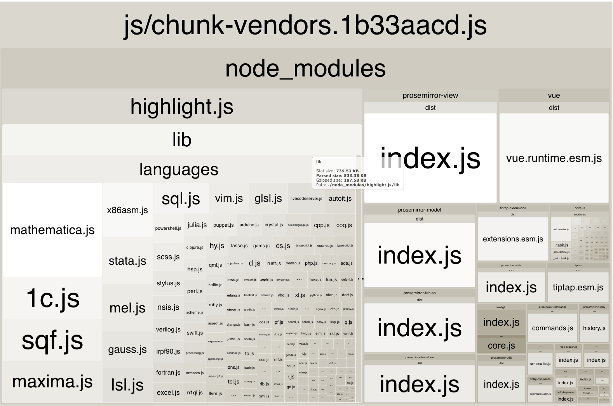

# tiptap-treeshaking
Example repository to reproduce the issue with tree shaking of tiptap and the `highlight.js` dependency.

No syntax highlight is used but the bundle still contains references to it. A better setup would just discard this dependency
from the bundle as it is not used anywhere else.

## Analyzing

```
npm install
npm run build
```

You should see something like the following screenshot:



> **Expected behavior**: to _not_ have `highlight.js` referenced in the production bundle.
